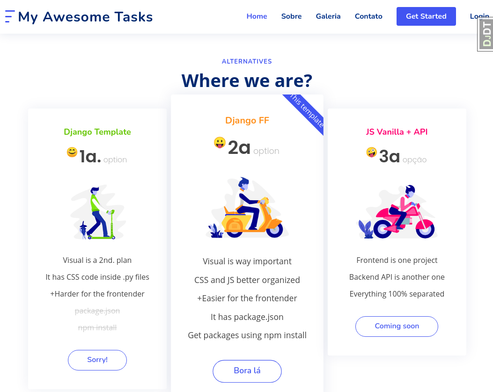

# cookiecutter-djangofloppyforms

When you have Front end developers in your team who wants to make usage of modern CSS/JS tools and the Django template way doesn't help so far, at the same time you cannot have a separated frontend project using a VueJS/React or Angular.

Well, this structure is something in the middle where it might help you in Django template land.



## Important

Have problems or questions, drop a message using the [Issues](https://github.com/huogerac/cookiecutter-djangofloppyforms/issues).

Contributions are welcome and if you like this repo, please, hit the star button!

## Why

- Empower front end developers inside Django projects (Django templates)
- Beautiful pages and UX matters
- Make it easier to install and use modern Javascript/CSS libraries
- Make it easier to use website templates (when you buy a pretty html website template)
- Make Django a little bit less monolithic
- Check [this blog post](https://huogerac.hashnode.dev/better-usage-of-jscss-inside-django-templates-with-django-floppyforms-ckoervqa101rmv9s1gzazhco7) out for more detailed explanation

## Requirements

- NodeJS and NPM: Please, (AVOID install it using `sudo apt-get install nodejs`), a good way is to
  use NVM and choose node 10 or 12. Check this [script here](https://github.com/huogerac/dev-tools/blob/master/install_nvm.sh) out or this [post](https://heynode.com/tutorial/install-nodejs-locally-nvm)

- Install cookiecutter to run this template: `pip install "cookiecutter>=1.7.0"`

- It's also recommended create a python virtualenv instead of install all python packages inside your environment:

  $ virtualenv ~/.ve/myapp
  $ source ~/.ve/myapp/bin/activate

## Usage

Run the cookiecutter command pointing to this repository:

    cookiecutter https://github.com/huogerac/cookiecutter-djangofloppyforms

Answer the question:

    project_name [My Awesome Tasks]: My Awesome Tasks
    project_slug [myawesometasks]:
    main_app [todo]: todo
    main_model [Task]: Task
    description [Behold My Awesome Project!]: My Awesome Tasks
    author_name [Roger Camargo]:
    domain_name [example.com]: mytasks.example.com
    email [roger-camargo@example.com]: huogerac@gmail.com
    version [0.1.0]:
    timezone [UTC]:

Go inside the new project folder and run the script below:

    cd myawesometasks/
    ./scripts/bootstrap.sh

Run the Django app:

    ./manage.py runserver

You can create an admin user using the following command

    ./manage.py createsuperuser

And run the tests using pytest

    pytest

[](https://asciinema.org/a/O33SwNhgsEelOom6pQ1xBRTz7)

## More details

```shell
myawesometasks
├── myawesometasks             ---> The project name
│   ├── settings.py
│   └── urls.py
├── scripts                    ---> Environment commands
├── templates
│   └── floppyforms            ---> Frontend components style (widget)
│       ├── layouts
│       └── rows
│       └── input.html
├── themes
│   ├── static
│   │   ├── themes
│   │   │   └── bootstrap-fs   ---> Assets from the site template
│   │   │       ├── css
│   │   │       ├── img
│   │   │       └── js
│   │   └── vendor             ---> Assets from node_modules (installed via npm)
│   └── templates
│       └── themes
│           └── bootstrap-fs   ---> Site template name
|               └── base.html  ---> Template structure (blocks standards)
└── todo                       ---> Main app name
    ├── migrations
    ├── services               ---> Service layer (avoid code inside views)
    ├── static
    │   └── todo
    │       └── img
    ├── templates
    │   └── todo
    │       └── mypage.html
    └── tests
        └── my_service_test.py

```
